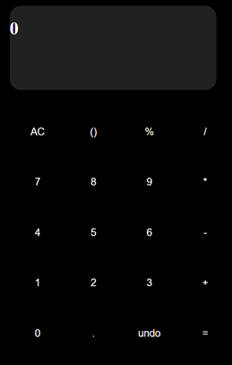

## 🔢 Calculator App

A simple, functional calculator web app built using HTML, CSS, and JavaScript.

## 📋 Project Overview

This calculator allows users to perform basic arithmetic operations including addition, subtraction, multiplication, and division. It also supports parentheses for operation precedence and features an "undo" function.

## 🖼️ Image




## 🚀 Features

- **Basic arithmetic operations**: Add, subtract, multiply, divide  
- **Parentheses**: For controlling operation precedence  
- **Undo**: Remove the last input  
- **Clear All (AC)**: Reset the calculator to the initial state  
- **Responsive Design**: The layout adjusts for different screen sizes  

## 🔗 Demo

You can view a live demo of the project [here]( https://rithushri-v-a.github.io/Calculator/).

## 🛠️ Technologies Used

- **HTML** for the structure  
- **CSS** for styling (Flexbox and Grid layout)  
- **JavaScript** for interactivity and logic (handling button presses and calculations)

## ▶️ How to Use

1. **Open the Calculator**: The app is ready to use immediately after loading in the browser.
2. **Input numbers and operators**: Click the number and operator buttons to create an expression.
3. **Evaluate the expression**: Press the "=" button to see the result.
4. **Clear or Undo**: Press the "AC" button to clear the display, or "undo" to remove the last entered character.

## 📦 Installation

1. **Clone the repository**:

   ```bash
   git clone https://github.com/your-username/calculator-app.git
   ``` 

2. **Navigate to the project directory**:

    ```bash
    cd calculator-app
    ``` 

3. **Open index.html in your browser to start using the app**:

    ```bash
    open index.html
    ``` 

**📝 Notes**
This is my first project created to learn the basics of JavaScript, HTML, and CSS. While this project works as intended, I’m excited to continue improving my skills. In future projects, I plan to enhance both the design and functionality, adding more features and refining the overall experience.

📌 Disclaimer: This project is for learning purposes only and does not have a license.
